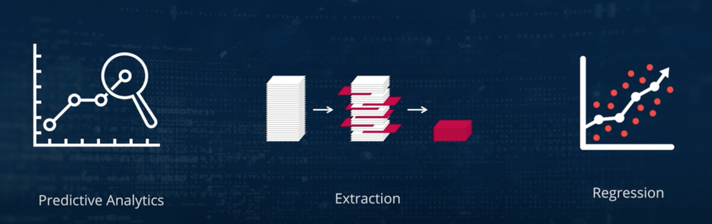

# Machine learning Course Overview
- It enhances several industrial and professional process 
- It also improves the quality of everyday life
- Following are some of example
    - Image recognition
    - Speech recognition
    - Medial diagnosis 
    - Statistical arbitrage 
    - Learning associations
    - Classifications
    - Predictive Analytics
    - Extractions
    - Regression
    - Financial and banking services
    
    
    
    
- Following are course objectives
    - Programmatically download the data
    - Check whether the data is valuable
    - Learn data visualization
    - Master the art of data analytics using IPython notebook
    - Gain insight of role of machine learning engineer 
        - Explain machine learning, its feature and application
        - Perform operation on industry based data and analyze them
        -  Learn the tools and technique for predective models
        - Discuss various machine learning algorithm and its application
        - Validate machine learning algorithm
- Course outline

# Introduction of Artificial Intelligence and Machine Learning
## Data Economy

## Artificial Intelligence 
- Definition of Artificial intelligence 

- Example
    - Self driving cars
    
    - Apple Sri
    
    - Google Alpha Go
    
    - Amazon Echo
    
    - IBM Watson
    
- Sci-Fi Movies with concept of AI

- Recommendations in eCommerce

## Relation between AI, ML and Data Science

## Machine learning

